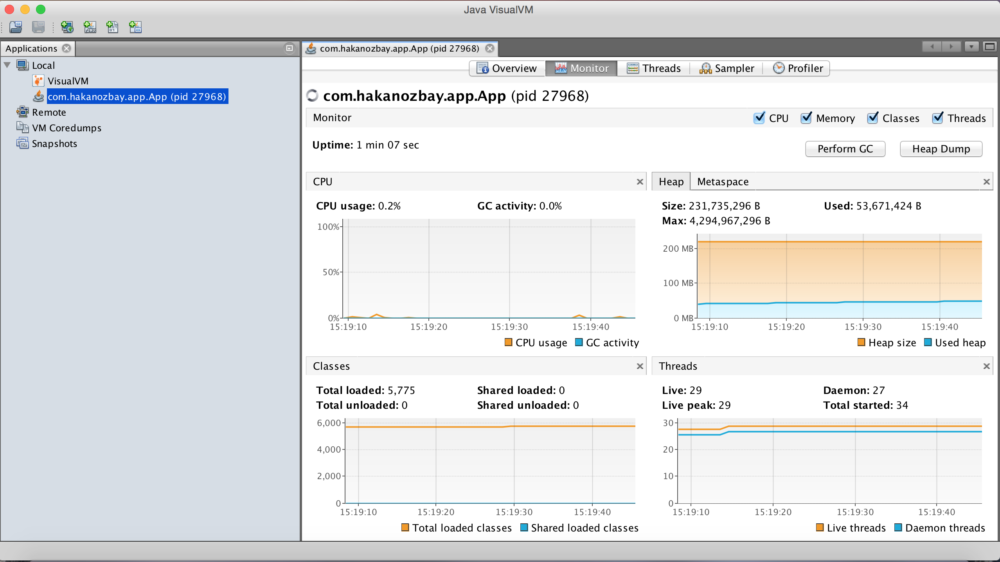
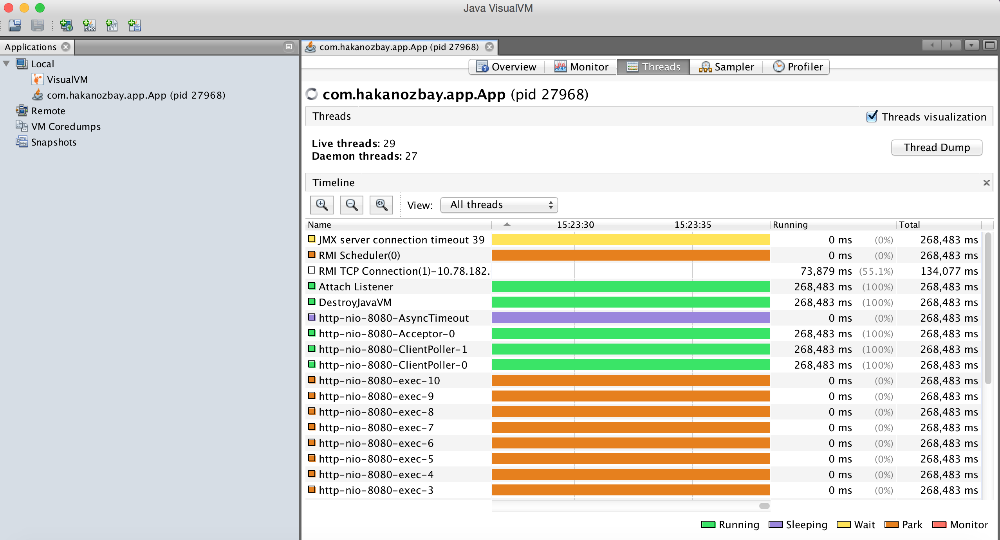
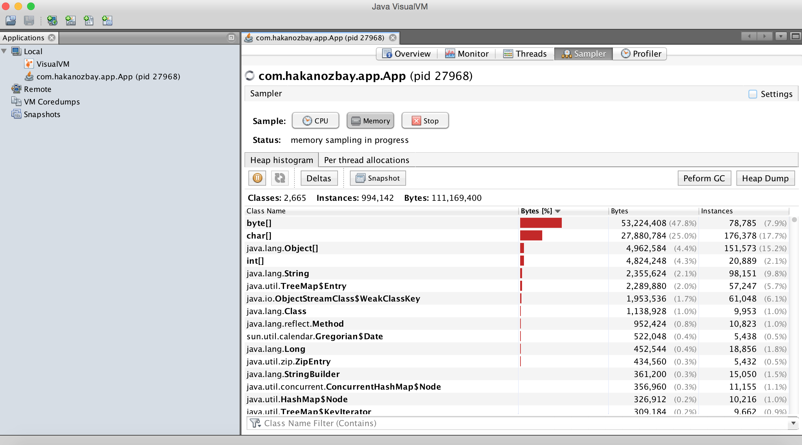

# Assemble executable application script and enable JMX monitoring in Maven

This is an example demonstration of creating executable application scripts and enabling JMX monitoring using [Maven][] and the [Appassembler][] Maven plugin through a [Spring Boot][] application.

## Overview

The [Appassembler][] plugin is a Maven plugin for generating scripts on Unix and Windows platforms to execute Java applications aswell as configuring the environment for the application to run in by arranging dependencies and configuration files in specific directories, setting up classpaths, allowing customization of JVM properties and definition of extra command line arguments to feed into the JVM.

This example demonstration shows a simple implementation of using the Appassembler plugin with additional command line arguments for enabling JMX monitoring, which is to be executed through a template Spring Boot Java application.

## Walkthrough of the application

The Spring Boot application runs a Tomcat webserver on port 8080 which shows a `Hello World!` message when accessing the URL [http://localhost:8080](http://localhost:8080). The application process itself will continue running until you terminate it yourself.

## Walkthrough of Appassembler configuration

In the `pom.xml` file of the project, the Appassembler is declared and configured:

```xml
<plugin>
	<groupId>org.codehaus.mojo</groupId>
	<artifactId>appassembler-maven-plugin</artifactId>
	<version>1.10</version>
	<executions>
		<execution>
			<phase>package</phase>
			<goals>
				<goal>assemble</goal>
			</goals>
		</execution>
	</executions>
	<configuration>
		<programs>
			<program>
				<name>${project.artifactId}</name>
				<mainClass>com.hakanozbay.app.App</mainClass>
				<platforms>
					<platform>all</platform>
				</platforms>
				<jvmSettings>
					<extraArgument>-Dcom.sun.management.jmxremote</extraArgument>
					<extraArgument>-Dcom.sun.management.jmxremote.port=9001</extraArgument>
					<extraArgument>-Dcom.sun.management.jmxremote.authenticate=false</extraArgument>
				</jvmSettings>
			</program>
		</programs>
	</configuration>
</plugin>			
```

This will invoke the `assemble` goal of the plugin when the `package` phase of the Maven build job is in execution.

During the `assemble` goal, there will be a Unix (.sh) script and a Windows (.bat) script created with the `${project.artifactId}` property as its name, which is `assemble-app-and-enable-jmx-monitoring`. 

A JVM program will be configured in those scripts that will startup using the main class `com.hakanozbay.app.App` with the additional command line parameters `-Dcom.sun.management.jmxremote`, `-Dcom.sun.management.jmxremote.port=9001`, `-Dcom.sun.management.jmxremote.authenticate=false`. These additional command lines are for enabling JMX monitoring, which is acessible through the port number 9001.

## Walkthrough of execution of the Appassembler plugin

Invocation of the plugin will be performed through the Maven build process. In this example the following Maven goals should be used: `clean package`. If you are running this on the command line then the command to type is : `mvn clean package`. This would need to be executed in the parent folder of the project where the pom.xml file is. Otherwise If you are using an IDE then you will need to just provide these goals into your IDE's Maven build exectuor.

The Maven build process will then execute the plugin and the generated output will be placed in the folder `target/appassembler`. In the appassembler folder there are 2 folders: `bin` and `repo`. The bin folder contains 2 generated scripts for Unix and Windows execution of the application. The repo folder contains the compile and runtime dependencies of the application as determined by the depenedency tree produced by Maven, through the pom.xml file.

## Walkthrough of application execution and JMX monitoring
To run the application, navigate to the `target/appassembler/bin` folder of your Maven project, and then execute one of the `assemble-app-and-enable-jmx-monitoring` scripts, whichever is the most suitable one for your Operating System. Successful startup of the application should show the following output in the console:

```
  .   ____          _            __ _ _
 /\\ / ___'_ __ _ _(_)_ __  __ _ \ \ \ \
( ( )\___ | '_ | '_| | '_ \/ _` | \ \ \ \
 \\/  ___)| |_)| | | | | || (_| |  ) ) ) )
  '  |____| .__|_| |_|_| |_\__, | / / / /
 =========|_|==============|___/=/_/_/_/
 :: Spring Boot ::        (v1.5.6.RELEASE)

2017-09-09 15:18:40.031  INFO 27968 --- [           main] com.hakanozbay.app.App                   : Starting App v0.0.1-SNAPSHOT on hakans-machine with PID 27968 (/workspace/maven-assemble-app-and-enable-jmx-monitoring/target/appassembler/repo/com/hakanozbay/assemble-app-and-enable-jmx-monitoring/0.0.1-SNAPSHOT/assemble-app-and-enable-jmx-monitoring-0.0.1-SNAPSHOT.jar started by hakan in /workspace/maven-assemble-app-and-enable-jmx-monitoring/target/appassembler/bin)
2017-09-09 15:18:40.034  INFO 27968 --- [           main] com.hakanozbay.app.App                   : No active profile set, falling back to default profiles: default
2017-09-09 15:18:40.134  INFO 27968 --- [           main] ationConfigEmbeddedWebApplicationContext : Refreshing org.springframework.boot.context.embedded.AnnotationConfigEmbeddedWebApplicationContext@3b2cf7ab: startup date [Sat Sep 09 15:18:40 BST 2017]; root of context hierarchy
2017-09-09 15:18:41.738  INFO 27968 --- [           main] s.b.c.e.t.TomcatEmbeddedServletContainer : Tomcat initialized with port(s): 8080 (http)
2017-09-09 15:18:41.755  INFO 27968 --- [           main] o.apache.catalina.core.StandardService   : Starting service [Tomcat]
2017-09-09 15:18:41.757  INFO 27968 --- [           main] org.apache.catalina.core.StandardEngine  : Starting Servlet Engine: Apache Tomcat/8.5.16
2017-09-09 15:18:41.919  INFO 27968 --- [ost-startStop-1] o.a.c.c.C.[Tomcat].[localhost].[/]       : Initializing Spring embedded WebApplicationContext
2017-09-09 15:18:41.919  INFO 27968 --- [ost-startStop-1] o.s.web.context.ContextLoader            : Root WebApplicationContext: initialization completed in 1795 ms
2017-09-09 15:18:42.049  INFO 27968 --- [ost-startStop-1] o.s.b.w.servlet.ServletRegistrationBean  : Mapping servlet: 'dispatcherServlet' to [/]
2017-09-09 15:18:42.056  INFO 27968 --- [ost-startStop-1] o.s.b.w.servlet.FilterRegistrationBean   : Mapping filter: 'characterEncodingFilter' to: [/*]
2017-09-09 15:18:42.056  INFO 27968 --- [ost-startStop-1] o.s.b.w.servlet.FilterRegistrationBean   : Mapping filter: 'hiddenHttpMethodFilter' to: [/*]
2017-09-09 15:18:42.056  INFO 27968 --- [ost-startStop-1] o.s.b.w.servlet.FilterRegistrationBean   : Mapping filter: 'httpPutFormContentFilter' to: [/*]
2017-09-09 15:18:42.057  INFO 27968 --- [ost-startStop-1] o.s.b.w.servlet.FilterRegistrationBean   : Mapping filter: 'requestContextFilter' to: [/*]
2017-09-09 15:18:42.387  INFO 27968 --- [           main] s.w.s.m.m.a.RequestMappingHandlerAdapter : Looking for @ControllerAdvice: org.springframework.boot.context.embedded.AnnotationConfigEmbeddedWebApplicationContext@3b2cf7ab: startup date [Sat Sep 09 15:18:40 BST 2017]; root of context hierarchy
2017-09-09 15:18:42.502  INFO 27968 --- [           main] s.w.s.m.m.a.RequestMappingHandlerMapping : Mapped "{[/]}" onto public java.lang.String com.hakanozbay.app.App.home()
2017-09-09 15:18:42.506  INFO 27968 --- [           main] s.w.s.m.m.a.RequestMappingHandlerMapping : Mapped "{[/error]}" onto public org.springframework.http.ResponseEntity<java.util.Map<java.lang.String, java.lang.Object>> org.springframework.boot.autoconfigure.web.BasicErrorController.error(javax.servlet.http.HttpServletRequest)
2017-09-09 15:18:42.506  INFO 27968 --- [           main] s.w.s.m.m.a.RequestMappingHandlerMapping : Mapped "{[/error],produces=[text/html]}" onto public org.springframework.web.servlet.ModelAndView org.springframework.boot.autoconfigure.web.BasicErrorController.errorHtml(javax.servlet.http.HttpServletRequest,javax.servlet.http.HttpServletResponse)
2017-09-09 15:18:42.539  INFO 27968 --- [           main] o.s.w.s.handler.SimpleUrlHandlerMapping  : Mapped URL path [/webjars/**] onto handler of type [class org.springframework.web.servlet.resource.ResourceHttpRequestHandler]
2017-09-09 15:18:42.540  INFO 27968 --- [           main] o.s.w.s.handler.SimpleUrlHandlerMapping  : Mapped URL path [/**] onto handler of type [class org.springframework.web.servlet.resource.ResourceHttpRequestHandler]
2017-09-09 15:18:42.578  INFO 27968 --- [           main] o.s.w.s.handler.SimpleUrlHandlerMapping  : Mapped URL path [/**/favicon.ico] onto handler of type [class org.springframework.web.servlet.resource.ResourceHttpRequestHandler]
2017-09-09 15:18:42.770  INFO 27968 --- [           main] o.s.j.e.a.AnnotationMBeanExporter        : Registering beans for JMX exposure on startup
2017-09-09 15:18:42.904  INFO 27968 --- [           main] s.b.c.e.t.TomcatEmbeddedServletContainer : Tomcat started on port(s): 8080 (http)
2017-09-09 15:18:42.914  INFO 27968 --- [           main] com.hakanozbay.app.App                   : Started App in 3.32 seconds (JVM running for 4.542)
```
At this point you are also ready to start up your JMX monitoring tool and connect to this process. I mostly use [JVisualVM][] to perform profiling and monitoring and will do so here to demonstrate. Once you open JVisualVM it should automatically identify and start monitoring your process if it is being run locally. If it is running on a remote server then you will need to add a remote host yourself in the GUI. As I am running it locally it automatically identifies it and starts monitoring:





## Conclusion
Using the [Appassembler][] plugin simplifies application execution setup and environment configuration by automating and abstracting away the different manual aspects of it to be easily done through 1 plugin, which is actually all performed during the compilation and packaging phase of your source code, thanks to Maven. Although this example is a simple one, it is an introduction into how easily you can configure, automatically generate and customize many settings when designing the deployment and runtime of your final artifact.

[Maven]: https://maven.apache.org/
[Appassembler]: http://www.mojohaus.org/appassembler/appassembler-maven-plugin/ 
[Spring Boot]: https://projects.spring.io/spring-boot/
[JVisualVM]: https://visualvm.github.io/